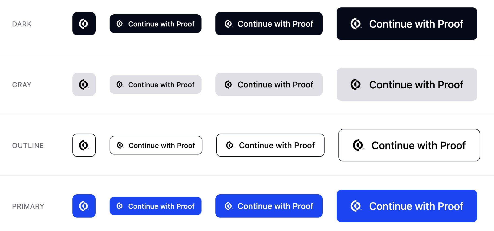

# Proof Digital Credentials - Web Components


_Web Components to harness Proof Digital Credentials built on top of [@proof.com/proof-vc-common](https://github.com/proof/proof-vc-common)._

Read our [documentation](https://dev.proof.com/docs/digital-credentials-overview) or [try them](https://demo.next.proof.com)!

## Table of Contents

- [Installation](#installation)
- [Getting Started](#getting-started)
  - [Transaction Templates](#transaction-templates)
- [Styles](#styles)
- [TypeScript](#typescript)
  - [React](#react)
- [Documentation](#documentation)
- [Contributing](#contributing)

## Installation

```
npm install @proof.com/proof-vc-web
```

## Getting Started

To request a Verifiable Presentation, `init` the client once at the start of your application:

```javascript
import { init } from "@proof.com/proof-vc-web";

init({
  environment: "sandbox",
  client_id: "<CLIENT_ID>",
  callback_uri: "<CALLBACK_URI>",
});
```

then use the `<proof-verify-id />` HTML tag anywhere:

```html
<proof-verify-id nonce="3e8e4918-e9fb-453a-a538-81152be15c1b" />
```

You can also provide a `login-hint` or `state`:

```html
<proof-verify-id
  nonce="3e8e4918-e9fb-453a-a538-81152be15c1b"
  state="6A2B4CD830"
  login-hint="frodo.baggins@theshire"
/>
```

### Transaction Templates

You can use _Transaction Templates_ provided by [@proof.com/proof-vc-common](https://github.com/proof/proof-vc-common) via
the `transactionData` prop:

```javascript
import { transactionData } from "@proof.com/proof-vc-web";

const data = transactionData.paymentItemized({
  title: "Drive Shaft",
  description: "The Roadhouse (18+), May 6 2026",
  currency: "USD",
  items: [
    { quantity: 2, unit_cost: 40.0, label: "General Admission" },
    { quantity: 2, unit_cost: 11.4, label: "Fees" },
  ],
});

<proof-verify-id
  nonce="3e8e4918-e9fb-453a-a538-81152be15c1b"
  transactionData={data}
/>;
```

## Styles

You can customize your `<proof-verify-id />` with the following attributes:

- `theme`: `dark` | `gray` | `outline` | `primary` (default)
- `size`: `icon` | `small` | `medium` (default) | `large`



## TypeScript

The package ships its own type definitions; everything you import from `@proof.com/proof-vc-web` is fully typed by default.

### React

`<proof-verify-id />` works in React 19+ JSX. To get type checking and prop autocomplete in TSX, opt in to the React types subpath in your project's `tsconfig.json`:

```json
{
  "compilerOptions": {
    "types": ["@proof.com/proof-vc-web/react"]
  }
}
```

Or, drop a triple-slash reference in any `.d.ts` file in your project:

```ts
/// <reference types="@proof.com/proof-vc-web/react" />
```

Both forms activate the `React.JSX.IntrinsicElements` augmentation that types `nonce`, `theme`, `size`, `transactionData`, and the other attributes.

## Documentation

_Digital Credentials_ guides https://dev.proof.com/docs/digital-credentials-overview \
_API Documentation_ https://dev.proof.com/reference/authorizeverifiablecredentialpresentation

## Contributing

[Contribution guidelines for this project](CONTRIBUTING.md)
